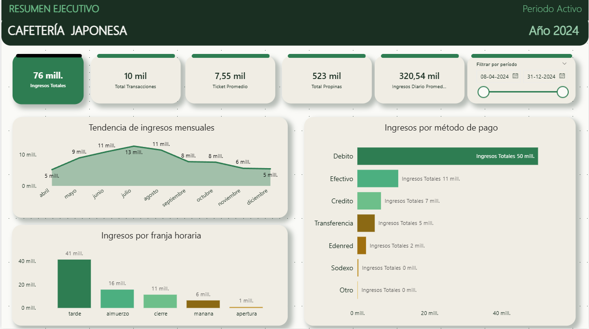
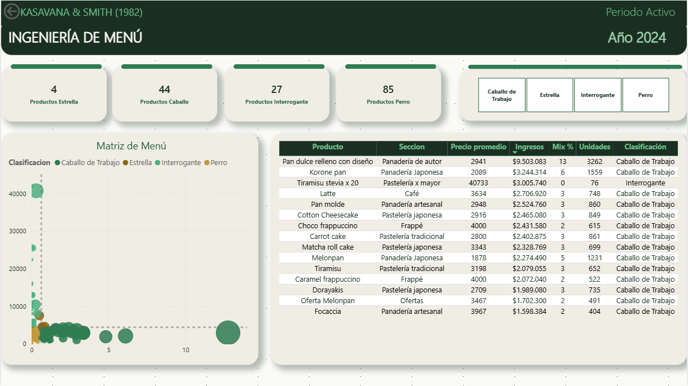
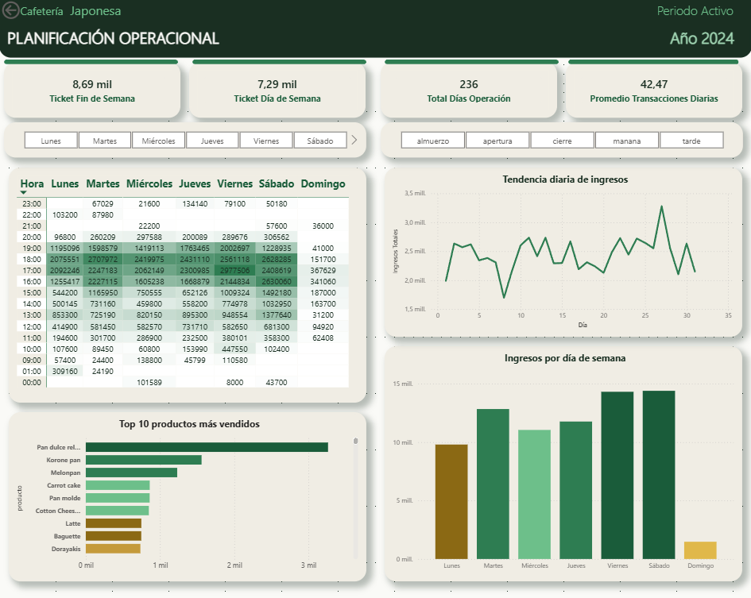

# Dashboard Power BI — Cafetería Japonesa

## Planteamiento del problema

Una cafetería artesanal "estilo japonesa" ubicada en Concepción, Chile 
necesita un dashboard ejecutivo que permita tomar decisiones operacionales 
en tiempo real sin depender de reportes manuales en Excel

## Vista previa del dashboard

### Página 1 — Resumen Ejecutivo

### Página 2 — Análisis de Menú

### Página 3 — Planificación Operacional

## Stack tecnológico

| Herramienta | Uso |
|---|---|
| Power BI Desktop | Diseño del dashboard |
| DAX | 19 medidas calculadas |
| CSV desde AWS S3 | Fuente de datos |
| Ingeniería de Menú | Marco analítico gastronómico |

## Estructura del dashboard

### Página 1 — Resumen Ejecutivo
- 5 KPI cards: Ingresos, Transacciones, Ticket Promedio, Propinas, Ingreso Diario
- Tendencia de ingresos mensuales
- Ingresos por método de pago
- Ingresos por franja horaria
- Segmentador de período

### Página 2 — Análisis de Menú (Kasavana & Smith, 1982)
- 4 KPI cards de clasificación (Estrellas, Caballos, Interrogantes, Perros)
- Matriz de Ingeniería de Menú (scatter plot interactivo)
- Top 15 productos por ingresos con formato condicional
- Segmentador por clasificación de menú

### Página 3 — Planificación Operacional
- 4 KPI cards operacionales
- Mapa de calor: ingresos por hora y día de semana
- Ingresos por día de semana
- Tendencia diaria de ingresos
- Top 10 productos más vendidos
- Segmentadores de día y franja horaria

## Medidas DAX

19 medidas documentadas en `docs/dax_measures.md`

## Hallazgos clave

- **Ingresos totales 2024:** $75,648,488 CLP
- **Ticket promedio:** $7,547 CLP
- **Ticket fin de semana:** mayor que días de semana (H2 confirmada)
- **Producto estrella:** Bubble Tea · Tokyo Box 2 · Curry Pan
- **Franja peak:** Tarde (16–19h)
- **Método de pago:** Débito lidera con 63.3%

## Relación con otros proyectos

Este dashboard es el P3 de un portafolio de 4 proyectos:

- P1: [EDA y estadística](https://github.com/rmoreno-dev/Coffe-ops-eda-analysis)
- P2: [Pipeline AWS](https://github.com/rmoreno-dev/aws-gastronomic-data-pipeline)
- P3: Este proyecto
- P4: Capstone integral (en construcción)

## Contexto del negocio

Datos reales de cafetería japonesa ubicada en Concepción, Chile,
con autorización del establecimiento. Datos anonimizados.

## Autor

**Rodolfo Moreno** · Cloud Data Analyst  
[LinkedIn](https://www.linkedin.com/in/rmoreno-dev) · 
[GitHub](https://github.com/rmoreno-dev)